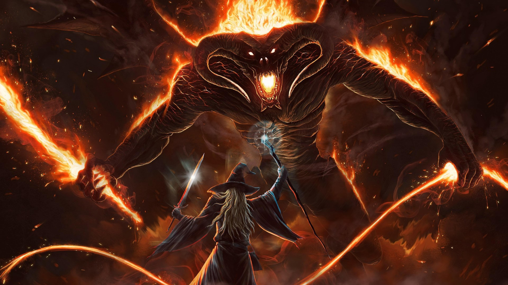

  

  

 

  

    👋 Hey, I'm Savani. I'm a third year CS undergraduate at UCL 
    <a href="https://www.linkedin.com/in/savani-sawaikar-1774331ba/" style="color: #B39DDB; text-decoration: none; border-bottom: 2px solid #7E57C2;">Reach out on Linkedin!</a>
  

 

  <h2 style="color: #D1C4E9; text-shadow: 0 0 5px #B39DDB; font-family: 'Press Start 2P', cursive;">⚔️ STATS</h2>
  

 

  <h2 style="color: #D1C4E9; text-shadow: 0 0 5px #B39DDB; font-family: 'Press Start 2P', cursive;">🔥 STREAK</h2>
  

 

  <h2 style="color: #D1C4E9; text-shadow: 0 0 5px #B39DDB; font-family: 'Press Start 2P', cursive;">📊 ACTIVITY</h2>
  

 

  <h2 style="color: #E1BEE7; text-shadow: 0 0 5px #CE93D8; font-family: 'Press Start 2P', cursive;">🧰 SKILLS</h2>
  

    
    
    
    
  

  

